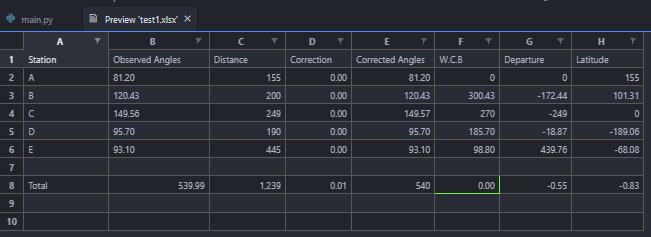

# Closed-Loop Traversing Computation with python-Openpyxl (Not Complete !!!)

A python script that calculate the Northens,Easterns, Latitude and Longitude of points given the Included Angles of the Points and the Distances between them.

